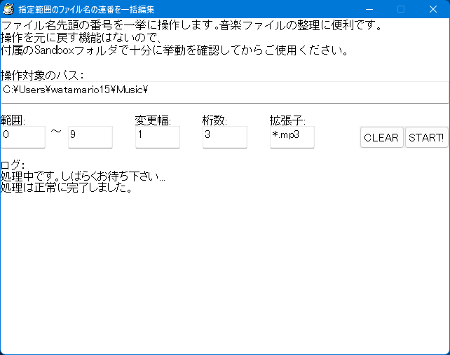

# 連番一括編集



ファイル名の最初につけられた番号を一挙に操作します。音楽ファイルなどの整理に役立つと思います。

## 使い方

> [!CAUTION]
> 操作を元に戻す機能はないので、付属の Sandbox フォルダで十分に挙動を確認してからご使用ください。自分で使うことしか考えていないので、想定外の構成のファイル名が混ざっていると誤動作するかもしれません。

実行ファイルは [Releases](../../releases) から取得でき、Windows XP 以降の日本語環境で動作します。Linux/macOS でも Wine を使えば多分動きます。実行ファイルと同じ場所に HSP3 公式拡張プラグインの `hspext.dll` を配置する必要があるので、こちらも忘れずにダウンロードしてください。

1. 処理したいフォルダをフルパスで指定します
2. 編集する連番の範囲を指定します
3. 編集で値をどれくらい変化させるかを「変更幅」で指定します
   - 例えば、1 進める場合は `1`、2 戻す場合は `-2` とします
4. 編集後の桁数を指定します
   - 例えば、`01` のようにしたい場合は `2`、`001` のようにしたい場合は `3` とします
5. 整理したいファイルの拡張子を指定します
   - 例えば、すべてのファイルを対象とする場合は `*`、mp3 ファイルのみを対象とする場合は `*.mp3` と入力します
6. 以上の設定を確認して START! を押します

ソースコードは [`filenumbers.hsp`](filenumbers.hsp) で、[Hot Soup Processor 3](https://hsp.tv) のスクリプトエディタで開けます。一般のテキストエディタを使う場合は Shift_JIS (CP932) で開いてください。

## 著作権

著作権を放棄し、Public Domain ([CC0-1.0](LICENSE)) で配布します。ただし、`hspext.dll` は HSP3 に付属する onion software の著作物を以下の条件に基づき再頒布しているものです（[出典元](https://www.onionsoft.net/hsp/v37/doclib/hspext.txt)）。

```text
・著作権および連絡先

 	ユーザーがHSPを使って作成したオリジナルのソフトウェア(実行ファイル)の
	権利は、それを作成したユーザーに属します。
	有償・無償を問わずHSPEXT.DLLを自由に配布することができ、onion softwareの
	著作権表示義務もありません。
	ユーザーが作成したオリジナルのソフトウェアに対してonion softwareが著作権を
	主張することはありません。

	HSPEXTプラグインは、onion softwareの著作物です。
	onion softwareは本プログラムによって生じた、いかなる損害についても
	保証いたしません。自己の責任の範囲で使用してください。
	HSPEXT.DLLは、Microsoft Visual Studio.NET 2003でコンパイルされて います。 
```
